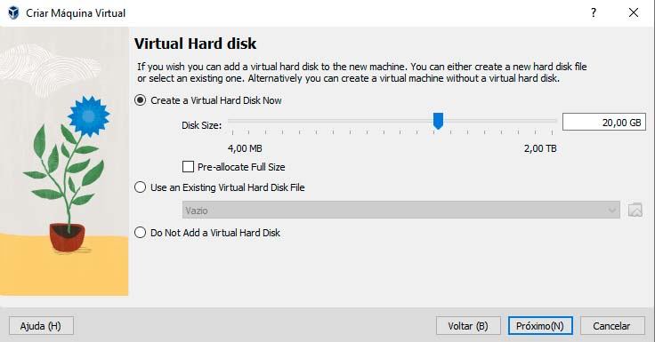
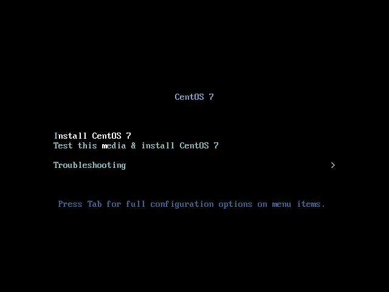
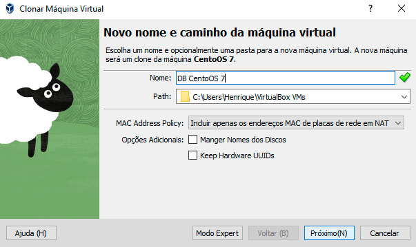
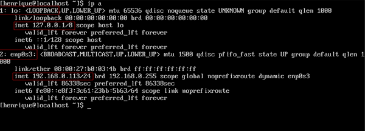

<h3 p align="center" > <i>Forgive me for any grammatical errors, English is not my native language. </i> </h3>

<h2 p align="center" > Creating VMs, using SSH connection and copying files between networks via SCP.
 </h2>

<i> 
 For this example I will use Oracle's Virtual Box.
 </i>

## Step 1 - Download the ISO.

- For our example I will use the ISO, CentOS 7.9.2009-Minimal.  
- http://mirror.ufscar.br/centos/7.9.2009/isos/x86_64/CentOS-7-x86_64-Minimal-2009.iso 

## Step 2 - Creating and setting up a VM.

 - Select the option, machine and new by mouse or shortcut Ctrl+N. 
 

        

- Write the name of your ISO the way you prefer and select the image, searching for it in the directory it was downloaded, in my case "C:/Users/Henrique/Downloads/CentOS-7-x86_64-Minimal-2009.iso".

 - Check the Skip Unattened Installation box to skip more detailed installation settings. 
 

- Select the hardware of your VM according to the capacity of your machine. 
 

 - Do the same with storage, we don't need more than a few GBs of space. 
 

 - After finishing the primary configuration we will return to the VM home screen, click on the gear icon or use the shortcut Ctrl+S. 
 

 - We will select in the Network tab the option Board in <b>Brige mode</b>.

 - In case there is any doubt about the connector types I will leave a brief explanation about the most common VM connections. 

 - Host only: the VM will be assigned an IP, but it will only be accessible on the box on which the VM is running. No other computer can access it. 

 - NAT : Just like your home network with a wireless router, the VM will be assigned in a separate subnet, like 192.168.6.1 is your host computer and the VM is 192.168.6.3, your VM can access the external network as your host, but no external access to your VM directly, it is protected. 

 - Bridged : Your VM will be on the same network as your host, if your host IP is 172.16.120.45 , your VM will be as 172.16.120.50 . It can be accessed by all computers on your host network. 
 

## Step 3 - Booting the VM

 - Here we will start using our newly created VM, but first we need to configure a few more details. 

 - Start your VM in normal mode to get CLI access. 

 - We chose an ISO with no graphical interface. 

 - Select the ISO installation option via the keyboard. 

 - After a few moments (depending on your machine) the installation will take you to the language selection screen, select the desired language and proceed with the installation. 

 - Select the partition created earlier. 

 - Click the finished button in the top left corner after selecting the disk. 

 - Click on the Network & Hostname option. 

 - Click on the switch to activate your connection, receiving the network settings such as ip, mask and default dns. 

 - If you skipped this step, it would have to be manually configured on the system via the <b>nmtui</b> command (check the command if you feel curious). 

 - We are almost there, if you wish create a user and then assign their permissions in <b>/etc/sudoers</b>. 

 - Once the settings are finished, shut down your VM because we will clone it to use a <b>SSH</b> connection. 

 - Right-click on the created ISO icon or use the shortcut Ctrl + O to the same destination. 

- Use the name you want, in this example we will use <b>DB CentOS 7</b>. </b>. 

 - Click the next button and select the soft link option, to clone an ISO on top of the storage space of our original ISO avoiding the need to create another storage disk. 

## Step 4 - SSH connection between VMs.

 - Start both VMs in normal mode. 
 

 - Log in with the credentials that you created. 

 - Use the <b>ip a or ip addr</b> command to identify the ip set for the VM. 

 - Note the rectangles in red, the first field identified by the number 1: followed by lo: with the <b>ip 127.0.0.1/8 which is the loopback ip</b>. 

 - Below we have our network card identified as 2: <b> enp0s3 with the ip below 192.168.0.113/24</b> which is the ip of our VM where we can do the SSH connection. 

 - Check if the SSHD server is active using the command <b>systemctl status sshd ou service sshd status</b>. If the service is not active on your VM, activate it using <b>systemctl start sshd</b>. 

 - If you want to leave the service active after reboot set the option: <b>systemctl enable sshd</b>. 

 - To access the other VM, first we must know its ip using the command <b>ip a or ip addr show</b>, in this case the ip is 192.168.0.112. 

 - To make the SSH connection just use the ssh command, followed by the vm user you want to access separating the ip from the name by the character <b>"@"</b>. 

 - This way the access to the other VM is <b>ssh monteiro@192.168.0.112</b>. Press enter and the terminal will ask for the password, after logging in you will be inside the other VM. 

 - We can see that in the VM that we are logged in there is no file in the home of the user Monteiro. 

 - Check the home directory with the command <b>"ls /home/"user"/". </b>

        
## Passo 5 - Step 5 - Copying files between VMs via SCPS.

 - Now we will use the <b>SCP command that derives from the junction of SSH + COPY </b>, similar to cp but that makes the copy through the <b>SSH connection</b>.</b>. 

 - Let's log out of this VM with the exit command. After the logout we will create an empty text file with the command <b>touch</b> in our home. 
.

 - Now through the SCP command we will copy this file to our other VM. 

     

 - Similar to the cp command, we are copying the text file from the current directory we are in without having to pass the absolute path which would be "/home/henrique/file.txt". 

- Using the command scp file.txt monteiro@192.168.0.112:/home/monteiro we are doing: 

        

 - First we copy the file from the current directory, then we pass the ssh connection we want, in this case <b>monteiro@192.168.0.112</b>, we use the syntax <b>":"</b> right after the last digit to concatenate the ssh connection with the absolute directory itself, which in this case is "/home/monteiro". 

 - This way we can access the other VM again via SSH and see the copy of the file. 

 - Using pwd to show the directory we are in and the ls command to show its contents, we note that the file was copied successfully. 

